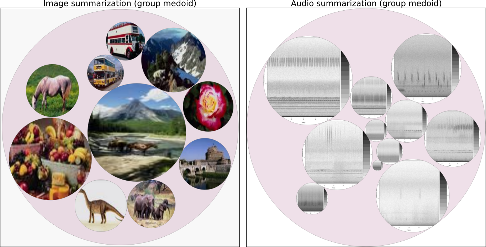

# xHiPP

This code is a new design for Hierarchical Point Placement Strategy (HiPP), called
eXtend HiPP (xHiPP). xHiPP is a Multidimensional Projection capable of present several levels
of data details. The paper of xHiPP process description is available on the [SIBGRAPI Digital Library](http://urlib.net/8JMKD3MGPAW/3RPBD6H)

## Getting Started

These instructions will get you a copy of the project to run on your local machine for development and testing purposes. 

### Prerequisites

If you are using Linux, verify whether the following packages are installed:

* [GCC](https://gcc.gnu.org/) -  C/C++ and Fortran Compiler
* [LAPCK](http://www.netlib.org/lapack/) - Standard software library for numerical linear algebra
* [BLAS](http://www.netlib.org/blas/) - Set of low-level routines for common linear algebra operations
* [Libxml2](http://xmlsoft.org/) - Library for parsing XML documents
* [GSL](https://www.gnu.org/software/gsl/) - Library for numerical computations in applied mathematics and science

These packages will be necessary to install R packages. After their installation, you will be able to install the next things

* [R](https://www.r-project.org/) - Download and install the R latest version
* [RStudio](https://www.rstudio.com/products/rstudio/download/) - Download and install the RStudio latest version
* [R packages](https://www.r-bloggers.com/installing-r-packages/) - Open RStudio and follow the previous link instructions to install these packages:  "jsonlite", "mp", "doParallel", "tm", "topicmodels", "SnowballC", "shiny", "mime", "stringr". If necessary, change the R repositories to install packages.

Tests that worked were performed with the following R versions: 3.3.1, 3.3.3 and 3.4.4. I tested with Slackware, Ubuntu, Mint and Windows 10.

Take care whether all these packages were really installed. If not, xHiPP will not run.

```
obs.: The run.R script has a routine to automatically install the R packages. Sadly, in Windows, this routine 
does not work. That's why the user needs to do it manually.
```

### Installing

```
After downloading and unzipping xHiPP directory, copy from run/ directory files: run.R, 
RUN_SERVER and RUN_CLIENT.  

obs.: If you are using Windows, please take .bat files. If you are using Unix-like, take .sh ones
```

```
Edit xHIPP.PATH variable into run.R to your correspondent xHiPP directory path. If you are using Windows, 
always use DOUBLE backslashes.  
```

```
Edit RUN_SERVER_PATH variable into RUN_SERVER to your correspondent run.R path. 
```

```
If it is necessary, edit USE_CHROME and SERVER_TCP_PORT variables into RUN_CLIENT to your desired 
configuration. 

obs.: The value of SERVER_TCP_PORT must be equal to the SERVER.TCP.PORT inside the run.R file.
```

## Running tests

First and foremost, execute the RUN_SERVER script. After this, just execute RUN_CLIENT to open your browse showing xHiPP. 

After loading, a user can interact with groups on the left and with treemap on the right, zooming in and out the structure. Moreover, there are some options to remove group boundary, present transparent groups or show some group summarization.  

A user can see information inside data points in different ways, depending on the data type (text, image, audio or other types of data).

**DEPENDING ON DATA AND ATTRIBUTE QUANTITY, AND CLUSTERING/PROJECTION ALGORITHMS CHOSEN, THE PROCESSING TIME CAN 
TAKE A LOT. PLEASE, BE CAREFUL WITH K-MEDOID ALGORITHM, BECAUSE OF ITS COMPLEXITY TIME.**

### File format (csv)

It is possible to load .csv files. The files must contain a column named as 'name' (identification column) and a column named as 'group' (data labels). If data are not labeled,
all items in column 'group' will have the same value. Column 'group' accept any value type (integer, string, etc.)

If the column 'name' has values that indicate file names, the extension of files will define how data is presented by xHiPP. 

* .txt to text files;
* .png | .jpg | .jpeg to image files;
* .mp3 | .wav to audio files;

Other file types or data without information about extension will be presented as ordinary data.

obs.: CSV files of text dataset can contain columns named as 'name' and 'group' that are linked with text word frequency. Please, rename these columns to xHiPP correctly encounter 
columns 'name' and 'group' especified above. For instance,

| name  | word1 | word2 | name.1 | word3 | word4 | group.1 | word5 | group |
| ----- | ----- | ----- | ------ | ----- | ----- | ------- | ----- | ----- |
| file1.txt | 0.3 | 0.5 | 0.4 | 0.2 | 0.1 | 0 | 0 | news |

obs.: Please, if your .csv file doesn't have the column named 'group', the last column of the file will be used as the data label.

### File format (json)

When a .csv file is processed, xHiPP save a .json with the tree structure in www/data/json to future use. Therefore, user can load preprocessed structures with xHiPP.
For instance, if one wants to change palette color, just change colors and load preprocessed file (json), instead of reprocess entire datset (csv).

### Directory structure

Files specified in column 'name' of the .csv file will be searched inside www/data in the directories audio, img or text. 

Audio files will be presented with respective spectrograms whether the audio and the corresponded image stay in the audio directory (e.g. sound.mp3 and sound.png are in www/data/audio directory). If just one of them (audio or image) is in the audio directory,
just it will be presented to the user.

### Data presentation

Depending on the value of 'name' column in .csv file, data will be presented in some forms. When a user clicks in
data points:

* Texts are presented for observation;
* Images are presented and a user can use arrow keys from keyboard to navigate in group images. Just images from the current group focused are shown;
* Audio is presented to play;
* To other data types, data attribute values are presented.

To summarize data groups:

* Groups are colored with the predominant color (label) inside them;
* Text groups could present text topics from their text items. On the right of visualization, a WordCloud from group words are presented;  
* Image groups could present medoid images;
* Audio groups could present spectrogram images from medoid item;
* To other data types, when mouse hover, images with a heatmap representing attribute values distribution.

### Cluster exportation

Users can export a CSV file with the current cluster items. The file contains information as id, group, and position generated by 
projection as following

| id  | X | Y | group |
| ----- | ----- | ----- | ------ |
| file1.txt | 0.3 | 0.5 | news |

## Screenshots

### Tool set


### Some data visions and summarization


### Image summarization



### Text summarization


