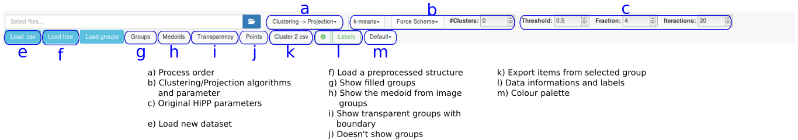
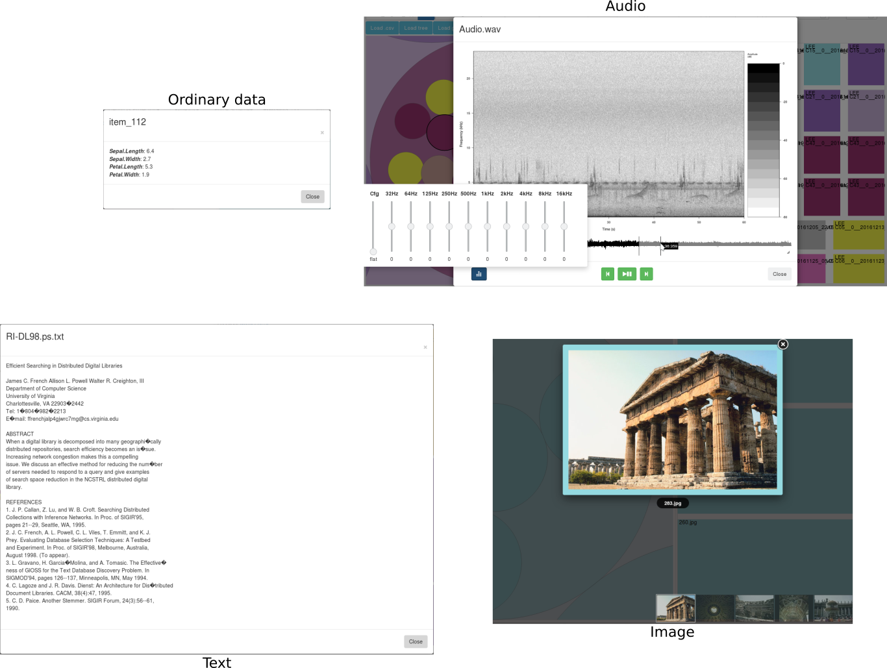
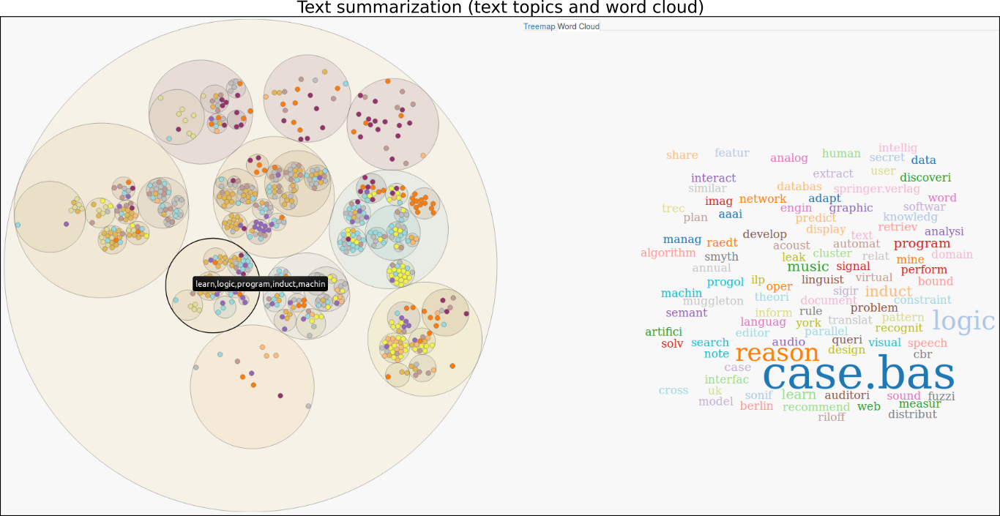

# xHiPP

This code is a new design for Hierarchical Point Placement Strategy (HiPP), called
eXtend HiPP (xHiPP). xHiPP is a Multidimensional Projection technique capable of present several levels
of data details. The paper of xHiPP process description is available on the [SIBGRAPI Digital Library](http://urlib.net/8JMKD3MGPAW/3RPBD6H).

## Getting Started

These codes and instructions will get you a copy of the project to run on your local machine for development and testing purposes.

### Prerequisites

If you are using Linux, verify whether the following packages are installed:

* [GCC](https://gcc.gnu.org/) -  C/C++ and Fortran Compiler;
* [LAPCK](http://www.netlib.org/lapack/) - Standard software library for numerical linear algebra;
* [BLAS](http://www.netlib.org/blas/) - Set of low-level routines for common linear algebra operations;
* [Libxml2](http://xmlsoft.org/) - Library for parsing XML documents;
* [GSL](https://www.gnu.org/software/gsl/) - Library for numerical computations in applied mathematics and science.

These packages will be necessary to install R packages. After their installation, you will be able to install the following things.

* [R](https://www.r-project.org/) - Download and install the R latest version;
* [RStudio](https://www.rstudio.com/products/rstudio/download/) - Download and install the RStudio latest version (just to help users that do not know R);
* [R packages](https://www.r-bloggers.com/installing-r-packages/) - Open RStudio and follow the previous link instructions to manually install the following packages:  "jsonlite", "mp", "umap", "doParallel", "tm", "topicmodels", "SnowballC", "shiny", "mime", "stringr". If necessary, change the R repositories to install packages (just for Windows users) .

> obs.: The run.R script has a routine to automatically install R packages. Sadly, on Windows, this routine does not 
work properly. That's why one needs to do it manually.

Take care whether all these packages were installed. If not, xHiPP will not run.

I have performed tests that worked with the following R versions: 3.3.1, 3.3.3, 3.4.4 and 3.6.1. I tested on Slackware 14.2, Ubuntu 14.04, Mint 18.2 and Windows 10.

### Installing

* After downloading and unzipping xHiPP directory, copy from run/ directory the scripts: run.R, 
RUN_SERVER and RUN_CLIENT. It is good to copy these files to another place, because when you install a new version they will be replaced; 

> obs.: If you are using Windows, please take .bat files. If you are using Unix-like, take .sh ones.

* Edit xHIPP.PATH variable into run.R script to your correspondent xHiPP directory path;

> obs.: If you are using Windows, always use DOUBLE backslashes on the paths. 

* Edit RUN_SERVER_PATH variable into RUN_SERVER script to your correspondent run.R path; 

* Edit USE_CHROME and SERVER_TCP_PORT variables into RUN_CLIENT script to set your desired configuration. 

> obs.: The value of SERVER_TCP_PORT must be equal to the SERVER.TCP.PORT inside the run.R file.

## Running

First and foremost, execute the RUN_SERVER script. After this, execute RUN_CLIENT to open your web browser with the xHiPP main view.

After starting, one can load data, interacts with groups on the left side and with treemap on the right side by zooming in and out the structure. Moreover, there are options to show groups summarization, present transparent groups or points without groups, to save items from a group focused and to visualize data related to points.

> Depending on the number of data items or data attributes, one should sampling items or select features before to execute xHiPP.
In my tests, ~5.000 items and ~500 features were the higher limits. As well as, be careful with k-medoid algorithm, because of its complexity time. 

> xHiPP will extract topics for text datasets. Thus, the processing time is influenciated by this process. Fortunately, the process is executed just 
one time for each text dataset.

### File format (csv)

It is possible to load .csv files. Files must contain a column named as **name** (identification column) and a column named as **group** (data labels). If data are not labeled,
all items in column **group** should have the same value. Column **group** accept any value type (integer, string, etc.)

If your file has no **name** column, a default identifier will be generated for your data items.
If your file has no **group** column, the last one will be used as the data label. Text datasets
are one exception. In this case, the topics generated will serve as data labels.
If the column **name** has values that indicate file names, the extension defines how xHiPP presents data, as following 

* .txt to text files;
* .png | .jpg | .jpeg to image files;
* .mp3 | .wav | .flac to audio files;
* Other extensions or data without information about extension will be presented as ordinary data.

> obs.: CSV files of text dataset can contain columns named as **name** and **group** that are linked with text word 
frequency. Please, rename these columns to xHiPP correctly encounter columns **name** and **group** specified above. 

| name  | word1 | word2 | name.1 | word3 | word4 | group.1 | word5 | group |
| ----- | ----- | ----- | ------ | ----- | ----- | ------- | ----- | ----- |
| file1.txt | 0.3 | 0.5 | 0.4 | 0.2 | 0.1 | 0 | 0 | news |

### File format (json)

When a .csv file is processed, xHiPP save a .json with the tree structure in *www/data/json* to future use. Therefore, user can load preprocessed structures with xHiPP.
For instance, if one wants to change palette color, just change colors and load preprocessed file (json), instead of reprocessing entire dataset (csv).

### Directory structure

Files specified in column **name** of the .csv will be searched inside *www/data* in the subdirectories audio, img or text. 

Audio files will be presented with respective spectrograms whether the audio and the corresponded image stay in the audio directory (e.g. sound.mp3 and sound.png are inside *www/data/audio*). 
If just one of them (audio or image) is inside the directory, it will be presented to the user.

> obs.: Browsers such as Firefox and Google Chrome can play only audios in PCM at 8 or 16 bits per sample.

### Data presentation

When a user clicks on data points:

* Texts are presented for reading;
* Images are presented and a user can use arrow keys from keyboard to navigate in other group images. Just images from the current group focused are shown;
* Audio is presented in a player with basic functions (forward, play/pause, backward) and equalizer controls. Beyond that, mouse hover on audio track shows time and
a mouse click can forward, and backward;
* Other data types will present data attribute values.

Associated with the hierarchical structure, xHiPP also presents a treemap, to help users visualize the distribution of data/labels inside the dataset.

To summarize data groups:

* Groups are colored with the predominant color (label) inside them;
* Text groups can present text topics from their items. On the right of visualization, a WordCloud from group words are presented;
* Image groups can present medoid images;
* Audio groups can present spectrogram images from medoid item;
* Other data types, when mouse hover, show images with a heatmap to represent attribute values distribution.

### Cluster exportation

Users can export a .csv file with the current cluster items. The file contains information as id, group, and position generated by 
projection as following

| id  | X | Y | group |
| ----- | ----- | ----- | ------ |
| file1.txt | 0.3 | 0.5 | news |

## Screenshots

### Tool set

### Views

### Data visualization

### Summarization

